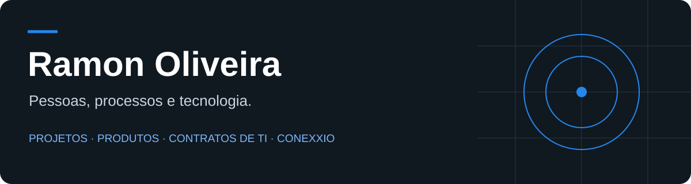

**Gestão de projetos, produtos e TI · CEO & Sócio Fundador da Conexxio Tecnologia**

[Atuação](#-onde-atuo) · [Tecnologia](#-minha-base-técnica) · [Projetos](#-explore-meus-repositórios) · [Trajetória](#-trajetória-e-qualificações)

## 👋 Sobre mim

Sou Ramon, profissional de TI com trajetória em desenvolvimento de sistemas, infraestrutura, liderança de equipes e gestão de projetos. Gosto de entender o problema, aproximar as pessoas certas e transformar necessidades de negócio em soluções que façam sentido na prática.

Minha experiência reúne desenvolvimento, gestão e acompanhamento de serviços de TI. Aqui compartilho projetos e estudos que complementam essa trajetória.

## 🎯 Onde atuo

| Empreendedorismo | Sistemas e contratos de TI |
| :--- | :--- |
| **CEO & Sócio Fundador · Conexxio Tecnologia** | **Analista de Sistemas e de Contratos de TI · ANATEL (terceirizado)** |
| Estratégia de produtos, diagnóstico de necessidades, automações, integrações e IA aplicada a negócios. | Planejamento de contratações, estudos técnicos, requisitos, documentação contratual e acompanhamento de indicadores e serviços. |
| [Conheça a Conexxio ↗](https://conexxio.com.br) | [Veja minha trajetória ↗](https://ramoncco.com.br/) |

**No dia a dia:** gestão ágil · roadmap e priorização · liderança de equipes · gestão de riscos · melhoria de processos · contratos de TI.

## 🛠 Minha base técnica

Tecnologias utilizadas ao longo da minha experiência em desenvolvimento:

Os repositórios públicos também incluem projetos e estudos em **TypeScript, Python e Java**, além de atividades da **DIO** e da **Rocketseat**.

## 🔎 Explore meus repositórios

| Projeto | Estudos e linguagens |
| :--- | :--- |
| **[React Weather App ↗](https://github.com/ramon-cco/React-Weather-App)** Aplicação de clima em React. | **[TypeScript ↗](https://github.com/ramon-cco/TypeScript)** Repositório de estudos em TypeScript. |
| **[NLW Together ↗](https://github.com/ramon-cco/nlw-together)** Projeto da semana NLW Together, da Rocketseat. | **[JavaScript ↗](https://github.com/ramon-cco/JavaScript)** Repositório de estudos em JavaScript. |
| **[Python DATA — DIO ↗](https://github.com/ramon-cco/Python_DATA---DIO)** Repositório com código em Python. | **[CurriculoApp ↗](https://github.com/ramon-cco/CurriculoApp)** Repositório com código em Java. |

[**Ver todos os repositórios →**](https://github.com/ramon-cco?tab=repositories)

## 🧭 Trajetória e qualificações

<strong>Experiência profissional</strong>

| Período | Organização | Atuação |
| --- | --- | --- |
| 2026–atualmente | Conexxio Tecnologia | CEO e Sócio Fundador: estratégia de produtos, diagnóstico de necessidades e soluções tecnológicas para negócios. |
| 2024–atualmente | ANATEL (terceirizado) | Análise de sistemas e contratos de TI: planejamento de contratações, estudos técnicos, documentação, indicadores e acompanhamento da execução contratual. |
| 2022–2024 | Whitewall/Solvitech | Gestão de projetos, produtos e TI: liderança de equipes, planejamento, roadmap e desenvolvimento de sistemas e microsserviços. |
| 2014–2022 | Exército Brasileiro | Análise de sistemas, DevOps, gestão de TI e projetos: aplicações web, infraestrutura, processos e contratos com fornecedores. |

<strong>Formação, certificações e cursos</strong>

### Formação

- Pós-graduação em Gestão Ágil de Projetos — Unyleya (2024).
- Pós-graduação em Gerenciamento de Projetos, com enfoque PMI — Unyleya (2024).
- MBA em Sistemas de Informação — ESAB (2020).
- Graduação em Sistemas de Informação — Faculdade Projeção (2015).
- Graduação em Análise e Desenvolvimento de Sistemas — Faculdade Projeção (2014).

### Certificações e cursos

- Scrum Product Owner Professional Certificate (SPOPC) — CertiProf (2025).
- Scrum Master Professional Certificate (SMPC) — CertiProf (2025).
- Design Sprint Professional Certification (DSPC) — CertiProf (2024).
- Scrum Foundation Professional Certification (SFPC) — CertiProf (2024).
- Scrum Fundamentals Certified — SCRUMstudy (2016).
- Formação em redes Cisco/CCNA Routing and Switching, conforme currículo (2016–2017).

## 🤝 Vamos conversar

Se você quer conversar sobre projetos, produtos, contratos de TI ou soluções para seu negócio, entre em contato pelo [LinkedIn](https://www.linkedin.com/in/ramoncco/) ou por [e-mail](mailto:ramoncco@gmail.com).

**Tecnologia com propósito. Gestão com responsabilidade.**

